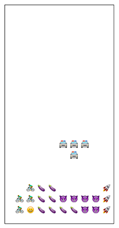

# Emoji Tetrominos

## work in progress.
Built with HTML Canvas and javascript.  Using Express, Auth0, Gulp & Babel.

## instructions
1) run `npm install`
2) run `node app.js`.  
3) go to localhost:8000
4) at this point you can play the game but there will be some (non-critical) js errors and stuff will look a little weird because auth0 isn't set up
5) go to auth0.com and get a free account
6) get your credentials and put them in /public/scripts/auth0-variables-example.js and save as /public/scripts/auth0-variables.js
7) add localhost:8000/callback to your whitelisted callback list in Auth0
8) when you refresh the game window, the errors should be gone

